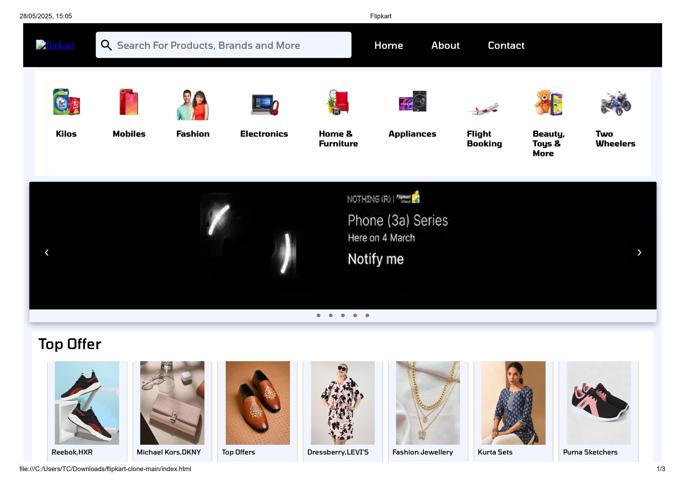

# 🛒 Flipkart Clone

A responsive **Flipkart Clone** built using simple **HTML**, **CSS**, and **JavaScript**. This project is a front-end replica of the Flipkart homepage and aims to demonstrate responsive web design and layout skills.

## 📸 Screenshots

  
*(Include screenshots of your project inside a `/screenshots` folder)*

---

## 🚀 Features

- Responsive design (mobile, tablet, desktop)
- Flipkart-style navigation bar
- Product listing with hover effects
- Promotional banners
- Footer with links and info
- Simple and clean UI

---

## 🛠️ Tech Stack

- **HTML5** - Markup structure
- **CSS3** - Styling & layout (Flexbox, Media Queries)
- **JavaScript** - Basic interactivity (e.g., toggles, sliders)

---

